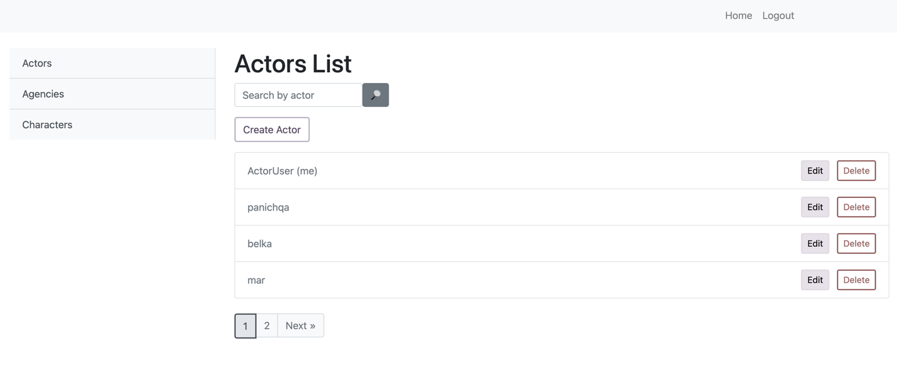

# freelance-actors
This is a Django web application designed for freelance actors and event agencies to manage and assign characters (costumes) to actors. Agencies can manage characters, actors can choose costumes, and everything is integrated with user authentication.

Features User authentication (Login, Logout, Registration). Actors can update their profiles and choose characters. Agencies can manage characters and actors. Agencies and characters have detailed view pages. CRUD operations for agencies and characters.

How to run the project

Clone the repository:
`git clone`

Navigate to the project directory:
`cd freelance_actors`

Install dependencies: Make sure you have pip installed.
Then run:
`pip install -r requirements.txt`

Apply migrations: 
`python manage.py migrate`

Run the server:
`python manage.py runserver`

Access the website:
Open a browser and go to http://127.0.0.1:8000/.

Login to test the site:
Use the following test credentials to log in:
For accessing Django admin, use these credentials:
Username: ActorUser
Password: asdf1234qwer 

Test functionality
Agencies: Create and manage agencies.
Characters: Add characters and assign them to agencies.
Actors: Actors can log in and update their profiles, select characters based on their gender and available costumes.
Running Tests
To run the tests, use the following command:
`python manage.py test`

